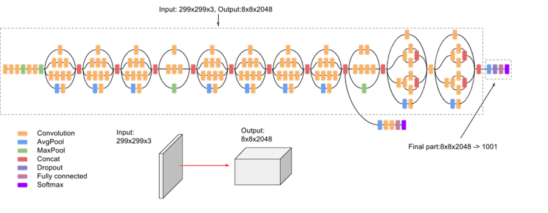

# Đề tài: Xây dựng hệ thống nhận diện ngôn ngữ ký hiệu
Sinh viên thực hiện: Nguyễn Phạm Tuấn Vũ  
Lớp: 19IT5   
Trường: Công nghệ thông tin và Truyển thông Việt Hàn  - ĐHĐN

# Chạy chương trình
Công nghệ sử dụng: Python, Tensorflow
## 1. Huấn luyện mô hình
**Note: Trước khi huấn luyện tải bộ dữ liệu trên Kaggle theo đường dẫn:    [ASL Alphabet](https://www.kaggle.com/datasets/grassknoted/asl-alphabet?datasetId=23079&sortBy=voteCount) 
. Giải nén ra thư mục `./data/`**

Bước 1: Tải các thư viện cần thiết bằng pip, gõ trên terminal như sau:    
`pip install -r requirements.txt`   
Bước 2: Chạy script sau:   
`python src/train.py` hoặc `ASL_Inceptionv3_final.ipynb`

# Model
Transfer learning mô hình Inception V3

 

# Kết quả
- Training accuracy:

- Fine-tune accuracy:

- Confusion matrix:

